# Project Poster

## Abstract
A concise interview preparation platform that generates tailored questions, records voice answers, analyzes speech, and provides actionable feedback using Python ML models and Firebase, delivered via a Next.js app.

## Architecture

## Data Pipeline

## API Surface

## Proposed Methodology
- Generate interview questions from role/experience/tech using pretrained recommenders.
- Capture answers via text or voice; analyze speech for prosody and clarity.
- Predict performance scores and store insights to Firestore for realtime feedback.

## Experimental Setup
- Tooling
  - Frontend: Next.js (app router), TypeScript, Tailwind.
  - Backend: Next.js API routes; Firebase Admin SDK.
  - Auth/DB: Firebase Auth + Firestore.
  - ML Runtime: Python 3.13 (venv in `ml_models/venv_mac/`).
  - ML Libraries: numpy, pandas, scikit-learn, nltk, textblob, scipy, joblib.
  - Diagrams: Mermaid (CLI) for SVG exports.

- Datasets & Artifacts
  - Q&A corpora in `dataset/` (domain: software/interview questions).
  - Pretrained artifacts in `ml_models/trained_models/`: `data_preprocessor.pkl`, `question_recommender.pkl`, `interview_predictor.pkl`, `speech_analyzer.pkl`.
  - Optional speech samples for validation (filler words, WPM, pauses).

- Environment & Configuration
  - Node.js per `package.json`; dependencies via `npm i`.
  - Python env: `python3 -m venv ml_models/venv_mac && pip install -r ml_models/requirements.txt`.
  - Firebase project credentials in `.env` for client; service account for server (`firebase/admin.ts`).

- Procedure
  1) Generate interview: POST `/api/interview/generate` → runs `generate_questions.py` → save to Firestore.
  2) Capture answers: text in UI; voice via `components/VoiceInterview.tsx` streaming to `/api/ml/analyze-speech` → `speech_analyzer.py`.
  3) Persist analysis: transcript, WPM, pause ratio, filler-rate to Firestore.
  4) Score session: PUT `/api/interview/[id]` → `interview_predictor.py` for prediction/score.
  5) Feedback view: aggregate question correctness + speech metrics; optional TTS via `/api/tts/speak`.

- Metrics
  - Model: question recommendation hit-rate@k, predictor MAE/RMSE, calibration.
  - Speech: words-per-minute (WPM), filler-rate (%), average pause duration, articulation score (proxy), sentiment.
  - UX: latency per API, time-to-first-feedback, completion rate.

- Evaluation Protocol
  - Split: hold-out sessions for scoring; k-fold for predictor where applicable.
  - Ablations: with/without speech features; domain-specific vs generic questions.
  - Reporting: charts of scores over sessions; trendlines for WPM/fillers; confusion for predicted vs observed outcome.

### Experimental sets (as per template)
- Experimental sets
- Inputs: UCI repository; specify the dimensionality of the data here
- (Pseudo code of main algorithm)

## Results (placeholder)
- Include charts of scores over sessions and speech metrics improvements.

## Conclusion and Future Work
- The system aids practice via targeted questions and instant analysis.
- Future: finer rubric scoring, multi-language TTS/ASR, and personalized curricula.

## References
- Internal docs in `ml_models/README.md` and `ML_FLOWCHART.md`.
