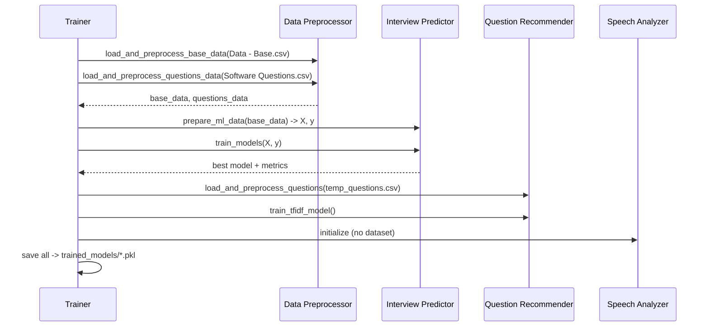
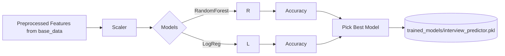
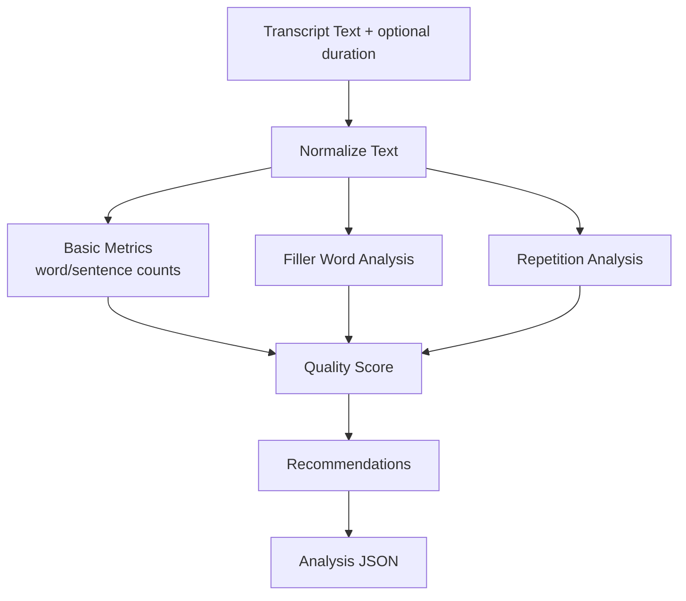

## ML System Flowcharts

Use these Mermaid diagrams to visualize the pipeline. You can render them in many markdown viewers, VS Code plugins, or online Mermaid renderers.

### 1) High-Level Components
```mermaid
flowchart LR
  A[Datasets]\nData - Base.csv\nSoftware Questions.csv --> B[Data Preprocessor]
  B -->|base features + target| C[Interview Predictor]
  B -->|cleaned Q/A + combined_text| D[Question Recommender]
  E[Speech Analyzer]\n(rule-based) -. no training .- E

  C --> F[(trained_models/\ninterview_predictor.pkl)]
  D --> G[(trained_models/\nquestion_recommender.pkl)]
  B --> H[(trained_models/\ndata_preprocessor.pkl)]
  E --> I[(trained_models/\nspeech_analyzer.pkl)]
```

### 2) Training Pipeline (`train_simple_pipeline.py`)


### 3) Question Generation (`generate_questions.py`)
```mermaid
flowchart TD
  UI[Inputs\nrole, level, techstack, type, amount] --> M{map params}
  M -->|role+techstack| Cat[Category]
  M -->|level| Dif[Difficulty]
  Cat --> QG[Retrieval Strategy]
  Dif --> QG

  subgraph Strategy
  QG1[1. category + difficulty]
  QG2[2. same category, other difficulties]
  QG3[3. related categories (role-aware)]
  QG4[4. any category (random sample)]
  end

  QG -->|de-duplicate & trim| OUT[Questions JSON]

  subgraph Model
  QR[(trained_models/\nquestion_recommender.pkl)]
  end

  QG -. uses .-> QR
```

### 4) Interview Prediction (`interview_predictor.py`)


### 5) Speech Analysis (`speech_analyzer.py`)


### Key File Locations
- Training artifacts: `ml_models/trained_models/`
  - `data_preprocessor.pkl`
  - `interview_predictor.pkl`
  - `question_recommender.pkl`
  - `speech_analyzer.pkl`
- Runtime generator: `ml_models/generate_questions.py`
- Orchestrated training: `ml_models/train_simple_pipeline.py`

### Notes
- Role-aware category mapping prioritizes domain (e.g., ML Engineer + Python → Machine Learning).
- Difficulty mapping: Junior→Easy, Senior/Lead→Hard, else Medium.
- If the primary bucket has too few questions, related-category fallbacks are used before random sampling.


